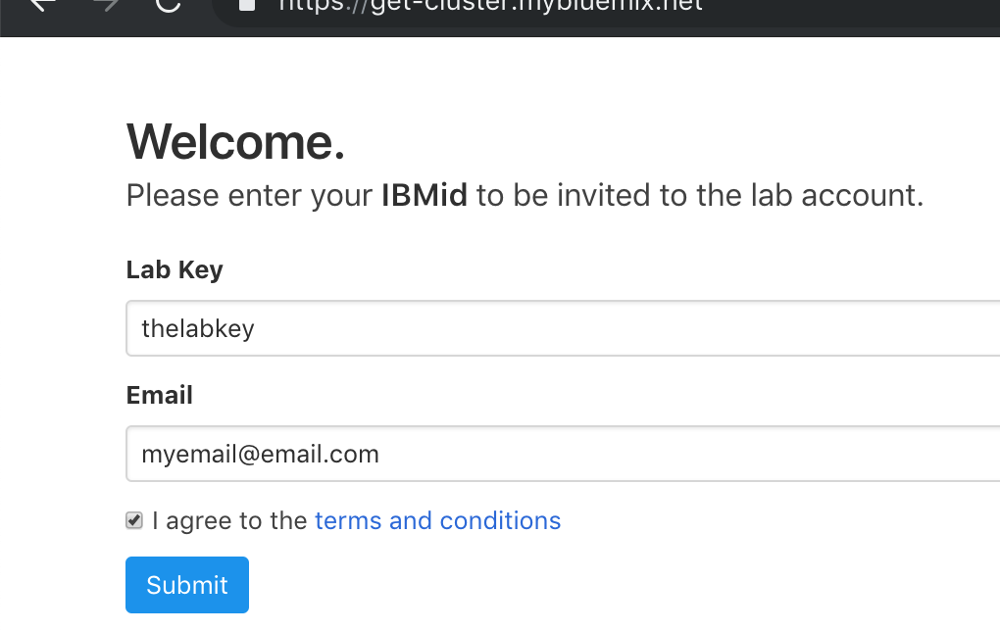

# Get Started
In this section, you will create your own IBM Cloud account, and then get access to a IBM Cloud Lab account which contains pre-provisioned clusters. Each lab attendee will be granted access to one cluster.

1. Create your own [IBM Cloud account](https://cloud.ibm.com/registration/?cm_mmc=Email_Events-_-Developer_Innovation-_-WW_WW-_-yla\CodeThinkGov-IBMUSFederalTechnologyEvent\Mar2019\unknown\naeastdevadvgrp\unknown\unknown\unknown\artificial-intelligence\blockchain\blockchain\containers\devops\microservices\&cm_mmca1=000019RS&cm_mmca2=10004805&cm_mmca3=M99938765&cvosrc=email.Events.M99938765&cvo_campaign=000019RS).
2. After the email verification, confirm by logging in to https://cloud.ibm.com
3. Go to [Grant Cluster](https://grant-cluster-kubecon.mybluemix.net/) web page and enter your IBM ID (the email you used to sign up)/
4. Select `EU-Central` for the region.

    

5. You will be added to the IBM Lab account and granted access to a cluster. Note the name of your cluster. It will be something like: `myclusterXXX`.
6. Refresh your [IBM Cloud Dashboard](https://cloud.ibm.com)
7. Switch to the **183569-IBM** account by clicking on the account selection drop down in the top nav bar.
8. Click on **Kubernetes Clusters** in the Resource Summary tile.

    

9. Under **Kubernetes Clusters**, click on the cluster that has been assigned to you.
10. Launch the **Kubernetes Dashboard** and have a look around! You can come back to this dashboard throughout your lab.
