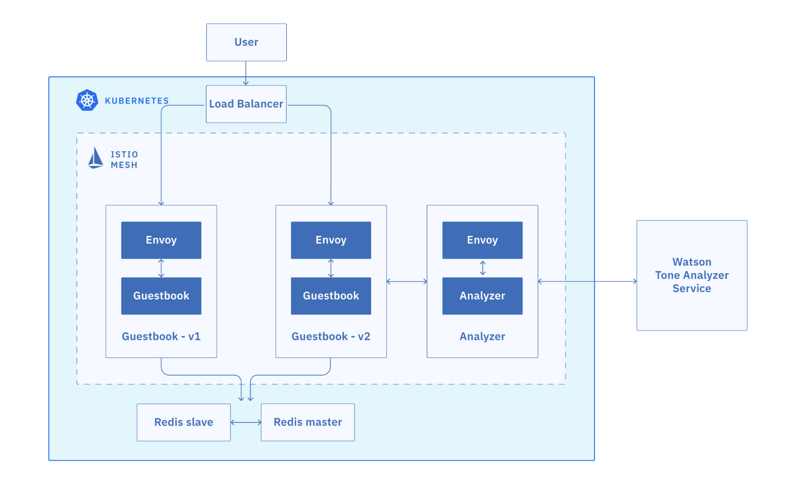

# Beyond the Basics: Istio and IBM Cloud Kubernetes Service
[Istio](https://www.ibm.com/cloud/info/istio) is an open platform to connect, secure, control and observe microservices, also known as a service mesh, on cloud platforms such as Kubernetes in IBM Cloud Kubernetes Service and VMs. With Istio, You can manage network traffic, load balance across microservices, enforce access policies, verify service identity, secure service communication and observe what exactly is going on with your services.

In this course, you can see how to install Istio alongside microservices for a simple mock app called [Guestbook](https://github.com/IBM/guestbook). When you deploy Guestbook's microservices into an IBM Cloud Kubernetes Service cluster where Istio is installed, you can choose to inject the Istio Envoy sidecar proxies in the pods of certain microservices.

## Objectives
After you complete this course, you'll be able to:
- Download and install Istio in your cluster
- Deploy the Guestbook sample app
- Use metrics, logging and tracing to observe services
- Set up the Istio Ingress Gateway
- Perform simple traffic management, such as A/B tests and canary deployments

## Architecture

[Get Started](GETSTARTED.md)

## Workshop setup
- [Exercise 1 - Accessing a Kubernetes cluster with IBM Cloud Kubernetes Service](exercise-1/README.md)
- [Exercise 2 - Installing Istio](exercise-2/README.md)
- [Exercise 3 - Deploying Guestbook sample application](exercise-3/README.md)

## Creating a service mesh with Istio

- [Exercise 4 - Observe service telemetry: metrics and tracing](exercise-4/README.md)
- [Exercise 5 - Expose the service mesh with the Istio Ingress Gateway](exercise-5/README.md)
- [Exercise 6 - Perform traffic management](exercise-6/README.md)

### Lab Instructors

- Sai Vennam, Product Manager
- Chris Rosen, Program Director
- Dan Berg, Distinguished Engineer
