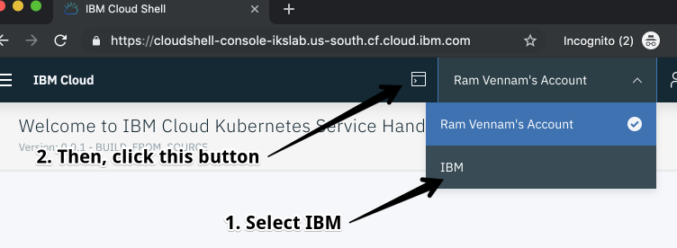

# Accessing a Kubernetes cluster with IBM Cloud Kubernetes Service

## Connect to your cluster using the Cloud Shell
For this lab, a web shell is provided for you with all the necessary tools. Use this web shell to perform the tasks in this lab. If you are having problems with this web shell, you can use a local docker container and follow the instructions [here](https://github.com/rvennam/istio101/blob/docker-env/workshop/exercise-1/README.md) instead.

Using Chrome or Firefox:

1.  Navigate to [IBM Cloud](cloud.ibm.com)
2.  Choose the IBM account
3.  Click the Cloud Shell icon on the top right.

    

## Access your cluster
Learn how to set the context to work with your cluster by using the `kubectl` CLI, access the Kubernetes dashboard, and gather basic information about your cluster.

1.  Set the context for your cluster in your CLI. Every time you log in to the IBM Cloud Kubernetes Service CLI to work with the cluster, you must run these commands to set the path to the cluster's configuration file as a session variable. The Kubernetes CLI uses this variable to find a local configuration file and certificates that are necessary to connect with the cluster in IBM Cloud.

    a. List the available clusters.

    ```shell
    ibmcloud ks clusters
    ```

    b. Set an environment variable for your cluster name:

    ```shell
    export MYCLUSTER=<your_cluster_name>
    ```

    c. Download the configuration file and certificates for your cluster using the `cluster-config` command.

    ```shell
    ibmcloud ks cluster config $MYCLUSTER
    ```

    d. Copy and paste the output command from the previous step to set the `KUBECONFIG` environment variable and configure your CLI to run `kubectl` commands against your cluster.

    Example: (_Do not copy/paste this exact command, but your result from the previous command_)
    
    ```shell
    export KUBECONFIG=/Users/user-name/.bluemix/plugins/container-service/clusters/mycluster/kube-config-hou02-mycluster.yml
    ```

2.  Get basic information about your cluster and its worker nodes. This information can help you manage your cluster and troubleshoot issues.

    a.  View details of your cluster.

    ```shell
    ibmcloud ks cluster get $MYCLUSTER
    ```

    b.  Verify the worker nodes in the cluster.

    ```shell
    ibmcloud ks workers $MYCLUSTER
    ```

3.  Validate access to your cluster by viewing the nodes in the cluster.

    ```shell
    kubectl get node
    ```

## Clone the lab repo

1.  From your command line, run:

    ```shell
    git clone https://github.com/IBM/istio101

    cd istio101/workshop
    ```

    This is the working directory for the workshop. You will use the example `.yaml` files that are located in the `workshop/plans` directory in the following exercises.
