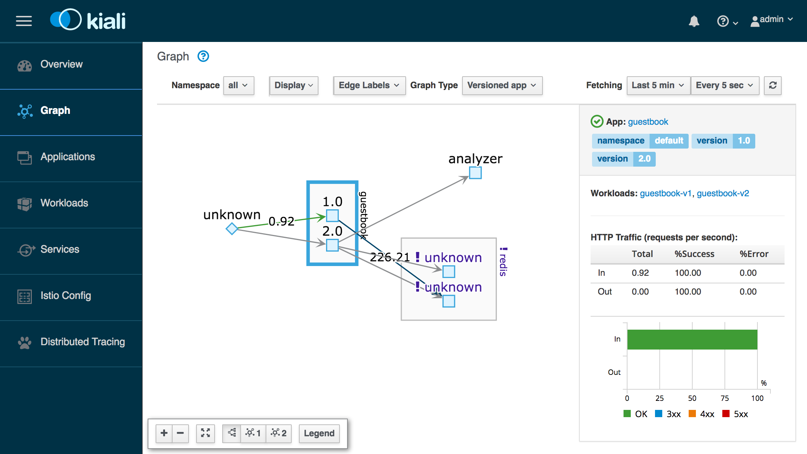

# Exercise 4 - Observe service telemetry: metrics and tracing

### Challenges with microservices

We all know that microservice architecture is the perfect fit for cloud native applications and it increases the delivery velocities greatly. Envision you have many microservices that are delivered by multiple teams, how do you observe the the overall platform and each of the service to find out exactly what is going on with each of the services?  When something goes wrong, how do you know which service or which communication among the few services are causing the problem?

### Istio telemetry

Istio's tracing and metrics features are designed to provide broad and granular insight into the health of all services. Istio's role as a service mesh makes it the ideal data source for observability information, particularly in a microservices environment. As requests pass through multiple services, identifying performance bottlenecks becomes increasingly difficult using traditional debugging techniques. Distributed tracing provides a holistic view of requests transiting through multiple services, allowing for immediate identification of latency issues. With Istio, distributed tracing comes by default. This will expose latency, retry, and failure information for each hop in a request.

You can read more about how [Istio mixer enables telemetry reporting](https://istio.io/docs/concepts/policy-and-control/mixer.html).

### Configure Istio to receive telemetry data

1. Verify that the Grafana, Prometheus, ServiceGraph and Jaeger add-ons were installed successfully. All add-ons are installed into the `istio-system` namespace.

    ```shell
    kubectl get pods -n istio-system
    kubectl get services -n istio-system
    ```

2. Configure Istio to automatically gather telemetry data for services that run in the service mesh. Create a rule to collect telemetry data.

    ```shell
    cd ../../plans/
    kubectl create -f guestbook-telemetry.yaml
    ```

3. Obtain the guestbook endpoint to access the guestbook.

    You can access the guestbook via the external IP for your service as guestbook is deployed as a load balancer service. Get the EXTERNAL-IP of the guestbook service via output below:

    ```shell
    kubectl get service guestbook -n default
    ```

    Go to this external ip address in the browser to try out your guestbook.


1. Generate a small load to the app.

    ```shell
    for i in {1..20}; do sleep 0.5; curl http://<guestbook_IP>/; done
    ```

## View guestbook telemetry data


#### Grafana

1. Establish port forwarding from local port 8082 to the Grafana instance:

    ```shell
    kubectl -n istio-system port-forward \
      $(kubectl -n istio-system get pod -l app=grafana -o jsonpath='{.items[0].metadata.name}') \
      8082:3000
    ```

2. Click on the web preview icon and select port 8082.
3. Click on Home -> Istio -> Istio Service Dashboard.
4. Select guestbook in the Service drop down.
5. In a different tab, visit the guestbook application and refresh the page multiple times to generate some load, or run the load script from above.


This Grafana dashboard provides metrics for each workload. Explore the other dashboard provided as well.

Use Ctrl-C to exit the port-foward when you are done.

#### Prometheus

1. Establish port forwarding from local port 8083 to the Prometheus instance.

    ```shell
    kubectl -n istio-system port-forward \
      $(kubectl -n istio-system get pod -l app=prometheus -o jsonpath='{.items[0].metadata.name}') \
      8083:9090
    ```
2. Click on the web preview icon and select port 8083, and in the “Expression” input box, enter: `istio_request_bytes_count`. Click Execute.
3. Then try another query: `istio_requests_total{destination_service="guestbook.default.svc.cluster.local", destination_version="2.0"}`


Use Ctrl-C to exit the port-foward when you are done.

#### Kiali

Kiali is an open-source project that installs on top of Istio to visualize your service mesh. It provides deeper insight into how your microservices interact with one another, and provides features such as circuit breakers and request rates for your services.

1. To get started with Kiali, you'll need to install it to your cluster. Run the full script below:

    ```
    JAEGER_URL="http://jaeger-query-istio-system.127.0.0.1.nip.io"
    GRAFANA_URL="http://grafana-istio-system.127.0.0.1.nip.io"
    VERSION_LABEL="v0.10.0"

    curl https://raw.githubusercontent.com/kiali/kiali/${VERSION_LABEL}/deploy/kubernetes/kiali-configmap.yaml | \
    VERSION_LABEL=${VERSION_LABEL} \
    JAEGER_URL=${JAEGER_URL}  \
    ISTIO_NAMESPACE=istio-system  \
    GRAFANA_URL=${GRAFANA_URL} envsubst | kubectl create -n istio-system -f -

    curl https://raw.githubusercontent.com/kiali/kiali/${VERSION_LABEL}/deploy/kubernetes/kiali-secrets.yaml | \
    VERSION_LABEL=${VERSION_LABEL} envsubst | kubectl create -n istio-system -f -

    curl https://raw.githubusercontent.com/kiali/kiali/${VERSION_LABEL}/deploy/kubernetes/kiali.yaml | \
    VERSION_LABEL=${VERSION_LABEL}  \
    IMAGE_NAME=kiali/kiali \
    IMAGE_VERSION=${VERSION_LABEL}  \
    NAMESPACE=istio-system  \
    VERBOSE_MODE=4  \
    IMAGE_PULL_POLICY_TOKEN="imagePullPolicy: Always" envsubst | kubectl create -n istio-system -f -
    ```

2. Establish port forwarding from local port 8084.

    ```shell
    kubectl -n istio-system port-forward \
        $(kubectl -n istio-system get pod -l app=kiali -o jsonpath='{.items[0].metadata.name}') \
        8084:20001
    ```
3. Click on the web preview icon and select port 8084 to access the Kiali dashboard. Login with the following username/password: `admin/admin`.

4. Click the "Graph" tab on the left side to see the a visual service graph of the various services in your Istio mesh. You can see request rates as well by clicking the "Edge Labels" tab and choosing "Traffic rate per second".

Kiali has a number of views to help you visualize your services. Click through the various tabs to explore the service graph, and the various views for workloads, applications and services.

 
 

#### [Continue to Exercise 5 - Expose the service mesh with the Istio Ingress Gateway](../exercise-5/README.md)
