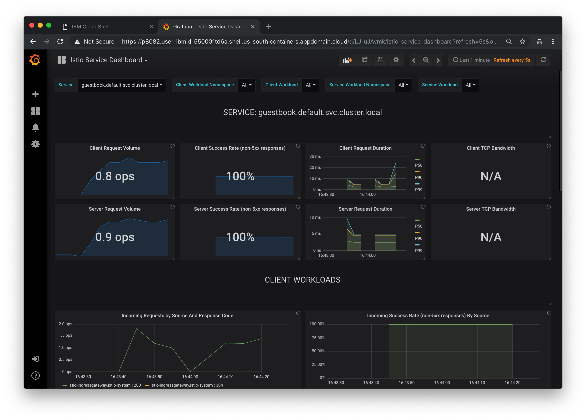
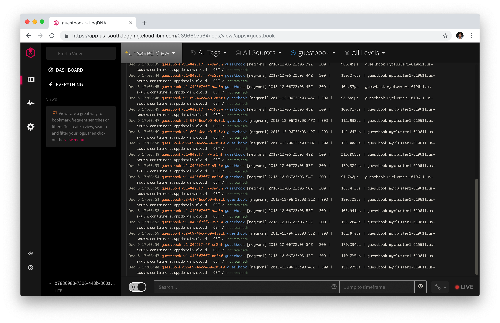

# Exercise 4 - Observe service telemetry: metrics and tracing

### Challenges with microservices

We all know that microservice architecture is the perfect fit for cloud native applications and it increases the delivery velocities greatly. Envision you have many microservices that are delivered by multiple teams, how do you observe the the overall platform and each of the service to find out exactly what is going on with each of the services?  When something goes wrong, how do you know which service or which communication among the few services are causing the problem?

### Istio telemetry

Istio's tracing and metrics features are designed to provide broad and granular insight into the health of all services. Istio's role as a service mesh makes it the ideal data source for observability information, particularly in a microservices environment. As requests pass through multiple services, identifying performance bottlenecks becomes increasingly difficult using traditional debugging techniques. Distributed tracing provides a holistic view of requests transiting through multiple services, allowing for immediate identification of latency issues. With Istio, distributed tracing comes by default. This will expose latency, retry, and failure information for each hop in a request.

You can read more about how [Istio mixer enables telemetry reporting](https://istio.io/docs/concepts/policy-and-control/mixer.html).

### Configure Istio to receive telemetry data

1. Verify that the Grafana, Prometheus, ServiceGraph and Jaeger add-ons were installed successfully. All add-ons are installed into the `istio-system` namespace.

    ```shell
    kubectl get pods -n istio-system
    kubectl get services -n istio-system
    ```

2. Configure Istio to automatically gather telemetry data for services that run in the service mesh. Create a rule to collect telemetry data.

    ```shell
    kubectl create -f guestbook-telemetry.yaml
    ```

3. Obtain the guestbook endpoint to access the guestbook.

    You can access the guestbook via the external IP for your service as guestbook is deployed as a load balancer service. Get the EXTERNAL-IP of the guestbook service via output below:

    ```shell
    kubectl get service guestbook -n default
    ```

    Go to this external ip address in the browser to try out your guestbook.
    


1. Generate a small load to the app.

    ```shell
    for i in {1..20}; do sleep 0.5; curl http://<guestbook_IP>/; done
    ```

## View guestbook telemetry data

#### Jaeger

1. Establish port forwarding from local port 8081 to the Tracing instance:

    ```shell
    kubectl port-forward -n istio-system \
      $(kubectl get pod -n istio-system -l app=jaeger -o jsonpath='{.items[0].metadata.name}') \
      8081:16686
    ```
2. Click on the web preview icon and select port 8081. 
> Note: You may need to add browser exceptions to access the dashboards in this exercise.

3. From the **Services** menu, select either the **guestbook** or **analyzer** service.
4. Scroll to the bottom and click on **Find Traces** button to see traces


Use Ctrl-C to exit the port-foward when you are done.

#### Grafana

1. Establish port forwarding from local port 8082 to the Grafana instance:

    ```shell
    kubectl -n istio-system port-forward \
      $(kubectl -n istio-system get pod -l app=grafana -o jsonpath='{.items[0].metadata.name}') \
      8082:3000
    ```

2. Click on the web preview icon and select port 8082.
3. Click on Home -> Istio -> Istio Service Dashboard.
4. Select guestbook in the Service drop down.
5. In a different tab, visit the guestbook application and refresh the page multiple times to generate some load.



This Grafana dashboard provides metrics for each workload. Explore the other dashboard provided as well.

Use Ctrl-C to exit the port-foward when you are done.

#### Prometheus

1. Establish port forwarding from local port 8083 to the Prometheus instance.

    ```shell
    kubectl -n istio-system port-forward \
      $(kubectl -n istio-system get pod -l app=prometheus -o jsonpath='{.items[0].metadata.name}') \
      8083:9090
    ```
2. Click on the web preview icon and select port 8083, and in the “Expression” input box, enter: `istio_request_bytes_count`. Click Execute.


Use Ctrl-C to exit the port-foward when you are done.

#### Service Graph

1. Establish port forwarding from local port 8084 to the Service Graph instance:

    ```shell
    kubectl -n istio-system port-forward \
      $(kubectl -n istio-system get pod -l app=servicegraph -o jsonpath='{.items[0].metadata.name}') \
      8084:8088
    ```

2. Click on the web preview icon and select port 8084.
3. Add `/dotviz` to the end of the URL

 

Use Ctrl-C to exit the port-foward when you are done.

#### Forward logs to LogDNA

LogDNA enables administrators, devops teams, and developers to filter, search, and tail log data. Define alerts and design custom views to monitor application and system logs. After you provision an instance of IBM Log Analysis with LogDNA on IBM Cloud, an account is created in LogDNA, and you receive the ingestion key for your account. Then, you must configure a LogDNA agent for each log source.

1. In your [IBM Cloud Dashboard](https://cloud.ibm.com) switch to your account using the drop down in the upper right corner.
2. Click on **Create Resource**, search for `logDNA` and **Create** an instance.
3. Click on **Edit Log Sources** 
4. Copy and paste the two commands in to your terminal. 
5. Return to the LogDNA window and click on **View LogDNA**
5. Visit your guestbook application in another window.
6. In the LogDNA dashboard, select guestbook in the All Apps dropdown.

You should see live logs in the dashboard. 

 


## Understand what happened

Although Istio proxies are able to automatically send spans, they need some hints to tie together the entire trace. Apps need to propagate the appropriate HTTP headers so that when the proxies send span information to Zipkin or Jaeger, the spans can be correlated correctly into a single trace.

In the example, when a user visits the Guestbook app, the HTTP request is sent from the guestbook service to Watson Tone Analyzer. In order for the individual spans of guestbook service and Watson Tone Analyzer to be tied together, we have modified the guestbook service to extract the required headers (x-request-id, x-b3-traceid, x-b3-spanid, x-b3-parentspanid, x-b3-sampled, x-b3-flags, x-ot-span-context) and forward them onto the analyzer service when calling the analyzer service from the guestbook service. The change is in the `v2/guestbook/main.go`. By using the `getForwardHeaders()` method, we are able to extract the required headers, and then we use the required headers further when calling the analyzer service via the `getPrimaryTone()` method.

#### [Continue to Exercise 5 - Expose the service mesh with the Istio Ingress Gateway](../exercise-5/README.md)
